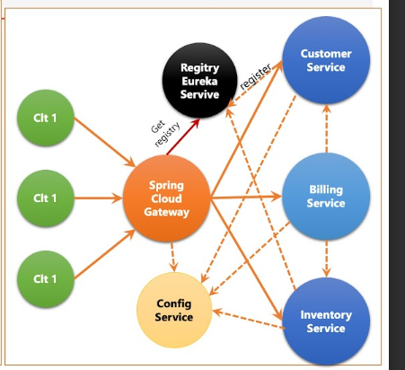
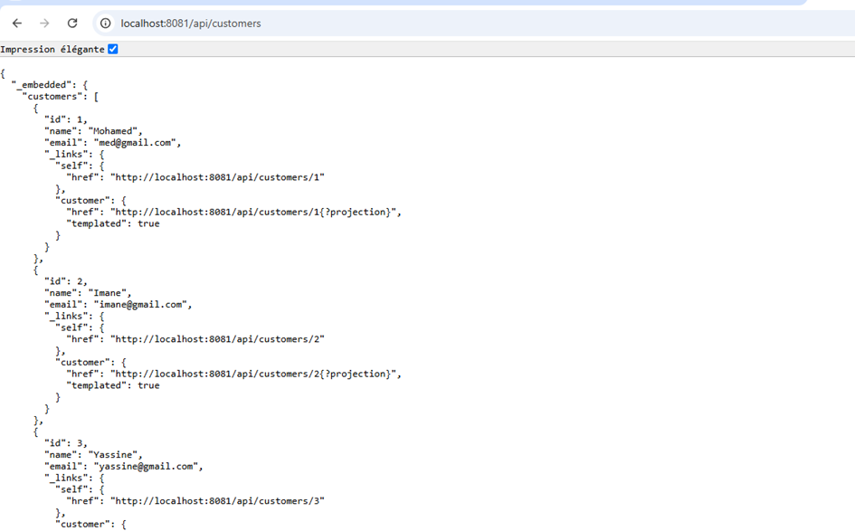
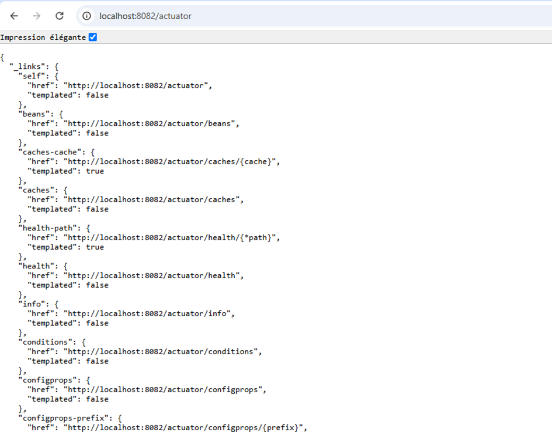
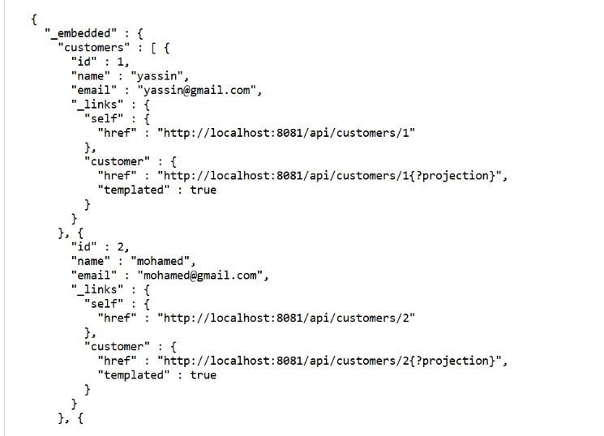
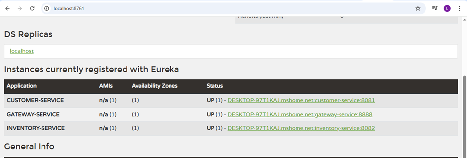
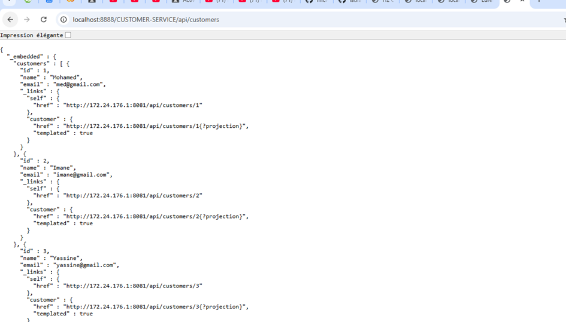
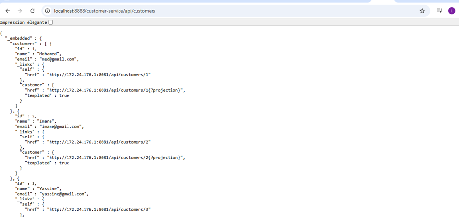
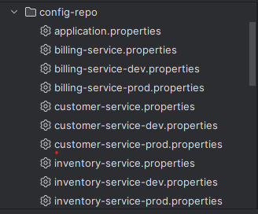

# Premier Projet Microservices

Dans ce projet, j'ai **créer ma première application basée sur une architecture microservices**, en explorant en profondeur ses **composants fondamentaux** et leur interaction.

---

## Objectifs du Projet

- Créer les **trois services essentiels** :
  - `discovery-service` (découverte)
  - `gateway-service` (passerelle)
  - `config-service` (configuration centralisée)
- Développer **trois microservices métier** :
  - `customer-service`
  - `inventory-service`
  - `billing-service`
- Comprendre **comment les services communiquent entre eux** via des mécanismes modernes (Eureka, Feign, Gateway, etc.)

---

## Architecture Générale



---

# 1. Customer Service

## Dépendances Maven

```xml
<dependencies>
    <dependency>
        <groupId>org.springframework.boot</groupId>
        <artifactId>spring-boot-starter-web</artifactId>
    </dependency>
    <dependency>
        <groupId>org.springframework.boot</groupId>
        <artifactId>spring-boot-starter-data-jpa</artifactId>
    </dependency>
    <dependency>
        <groupId>com.h2database</groupId>
        <artifactId>h2</artifactId>
        <scope>runtime</scope>
    </dependency>
    <dependency>
        <groupId>org.springframework.boot</groupId>
        <artifactId>spring-boot-starter-data-rest</artifactId>
    </dependency>
    <dependency>
        <groupId>org.springframework.cloud</groupId>
        <artifactId>spring-cloud-starter-netflix-eureka-client</artifactId>
    </dependency>
    <dependency>
        <groupId>org.springframework.cloud</groupId>
        <artifactId>spring-cloud-starter-config</artifactId>
    </dependency>
    <dependency>
        <groupId>org.springframework.boot</groupId>
        <artifactId>spring-boot-starter-actuator</artifactId>
    </dependency>
</dependencies>
```

> **Explication** :
> - `spring-boot-starter-web` : pour créer une API REST
> - `spring-boot-starter-data-jpa` + `h2` : base de données en mémoire
> - `spring-boot-starter-data-rest` : expose automatiquement les repositories en REST
> - `eureka-client` : pour s’enregistrer dans le service de découverte
> - `config-client` : pour récupérer la configuration à distance
> - `actuator` : monitoring et gestion du service

---

## Composants de Base

### 1. Entité `Customer`

```java
@Entity
@Data @NoArgsConstructor @AllArgsConstructor
public class Customer {
    @Id @GeneratedValue(strategy = GenerationType.IDENTITY)
    private Long id;
    private String name;
    private String email;
}
```

### 2. Repository avec Spring Data REST

```java
@RepositoryRestResource
public interface CustomerRepository extends JpaRepository<Customer, Long> {}
```

> Spring Data REST expose automatiquement `/customers` en GET, POST, etc.

### 3. Base H2 & Données de Test

```java
@Bean
CommandLineRunner start(CustomerRepository repository) {
    return args -> {
        repository.save(new Customer(null, "Ali", "ali@gmail.com"));
        repository.save(new Customer(null, "Sara", "sara@gmail.com"));
        repository.save(new Customer(null, "Omar", "omar@gmail.com"));
    };
}
```

### 4. Configuration H2 (dans `application.properties`)

```properties
spring.h2.console.enabled=true
spring.datasource.url=jdbc:h2:mem:customer-db
```

---

## Configurations Temporaires (Désactivation)

Au début, on désactive l’enregistrement dans Eureka et Config Server :

```properties
spring.cloud.discovery.enabled=false
spring.cloud.config.enabled=false
```

> **Pourquoi ?**  
> Pour tester le service **isolément** avant de l’intégrer dans l’écosystème.

---

## Spring Data REST : Exposer les IDs

Par défaut, **les IDs ne sont pas exposés** dans les réponses JSON.

### Solution : Configuration personnalisée

```java
@Configuration
public class RestRepositoryConfig implements RepositoryRestConfigurer {
    @Override
    public void configureRepositoryRestConfiguration(RepositoryRestConfiguration config, CorsRegistry cors) {
        config.exposeIdsFor(Customer.class);
    }
}
```

> Maintenant, `GET /api/customers` renvoie les `id`.

---


## Projections (Vues Partielles)

On peut créer des **projections** pour contrôler les champs retournés.

```java
@Projection(name = "all", types = Customer.class)
public interface CustomerProjection {
    String getName();
    String getEmail();
}

@Projection(name = "email", types = Customer.class)
public interface CustomerProjection2 {
    String getEmail();
}
```

**Utilisation** :
```
GET /api/customers?projection=all
GET /api/customers?projection=email
```

---

## Changer le chemin de base

```properties
spring.data.rest.base-path=/api
```

> Avant : `http://localhost:8081/customers`  
> Après : `http://localhost:8081/api/customers`

---

## Actuator : Monitoring & Gestion

Ajout de la dépendance `spring-boot-starter-actuator`.

### Activer tous les endpoints

```properties
management.endpoints.web.exposure.include=*
```

### Endpoints utiles

| Endpoint | Utilité |
|--------|--------|
| `/actuator/health` | Vérifie si le service est **UP** |
| `/actuator/info` | Infos personnalisées |
| `/actuator/refresh` | Rafraîchir la config (POST) |




> Kubernetes utilise `/actuator/health` pour les **health checks**.

---

> **Note** : On applique **les mêmes étapes** pour `inventory-service` avec l’entité `Product`.

---

# 2. Gateway Service

## Rôle
Rediriger les requêtes vers les bons microservices.

## Dépendances

```xml
<dependency>
    <groupId>org.springframework.cloud</groupId>
    <artifactId>spring-cloud-starter-gateway</artifactId>
</dependency>
<dependency>
    <groupId>org.springframework.cloud</groupId>
    <artifactId>spring-cloud-starter-netflix-eureka-client</artifactId>
</dependency>
<dependency>
    <groupId>org.springframework.boot</groupId>
    <artifactId>spring-boot-starter-actuator</artifactId>
</dependency>
<dependency>
    <groupId>org.springframework.cloud</groupId>
    <artifactId>spring-cloud-starter-config</artifactId>
</dependency>
```

---

## Configuration : `application.yml`

### Approche Statique (URLs fixes)

```yaml
spring:
  cloud:
    gateway:
      routes:
        - id: r1
          uri: http://localhost:8081/
          predicates:
            - Path=/api/customers/**
        - id: r2
          uri: http://localhost:8082/
          predicates:
            - Path=/api/products/**
```

> Accès via :  
> `http://localhost:8888/api/customers`


---

# 3. Discovery Service (Eureka)

## Dépendance

```xml
<dependency>
    <groupId>org.springframework.cloud</groupId>
    <artifactId>spring-cloud-starter-netflix-eureka-server</artifactId>
</dependency>
```

## Classe principale

```java
@SpringBootApplication
@EnableEurekaServer
public class DiscoveryServiceApplication {
    public static void main(String[] args) {
        SpringApplication.run(DiscoveryServiceApplication.class, args);
    }
}
```

## Configuration (`application.properties`)

```properties
server.port=8761
eureka.client.register-with-eureka=false
eureka.client.fetch-registry=false
```

> Interface web : `http://localhost:8761`

---

## Enregistrement des Microservices

Dans **chaque microservice** (customer, inventory, gateway) :

```properties
spring.cloud.discovery.enabled=true
eureka.client.service-url.defaultZone=http://localhost:8761/eureka
eureka.instance.prefer-ip-address=true
```

> Les services apparaissent dans le tableau de bord Eureka.



---

## Approche Dynamique dans le Gateway

Remplacer les URLs fixes par `lb://NOM-SERVICE`

```yaml
spring:
  cloud:
    gateway:
      routes:
        - id: r1
          uri: lb://CUSTOMER-SERVICE
          predicates:
            - Path=/api/customers/**
        - id: r2
          uri: lb://INVENTORY-SERVICE
          predicates:
            - Path=/api/products/**
```

> `lb://` = **Load Balancer** via Eureka

---

## Découverte Automatique (Discovery Locator)

Supprimez `application.yml` et ajoutez :

```java
@Bean
DiscoveryClientRouteDefinitionLocator locator(
    ReactiveDiscoveryClient rdc,
    DiscoveryLocatorProperties props
) {
    return new DiscoveryClientRouteDefinitionLocator(rdc, props);
}
```

**Accès** :
```
http://localhost:8888/CUSTOMER-SERVICE/api/customers
```


> Pour autoriser les minuscules :

```properties
spring.cloud.gateway.discovery.locator.lower-case-service-id=true
```


---

# 4. Billing Service

## Rôle
Gérer les factures en appelant `customer-service` et `inventory-service`.

## Nouvelles Dépendances

```xml
<dependency>
    <groupId>org.springframework.cloud</groupId>
    <artifactId>spring-cloud-starter-openfeign</artifactId>
</dependency>
```

---

## Modèles

```java
@Entity
@Data @Builder @NoArgsConstructor @AllArgsConstructor
public class Bill {
    @Id @GeneratedValue(strategy = GenerationType.IDENTITY)
    private Long id;
    private LocalDateTime billingDate;
    private long customerId;
    @OneToMany(mappedBy = "bill")
    private List<ProductItem> productItems = new ArrayList<>();
    @Transient
    private Customer customer;
}

@Entity
@Data @NoArgsConstructor @AllArgsConstructor
public class ProductItem {
    @Id @GeneratedValue(strategy = GenerationType.IDENTITY)
    private Long id;
    private String productId;
    private int quantity;
    private double unitPrice;
    @ManyToOne
    @JsonProperty(access = JsonProperty.Access.WRITE_ONLY)
    private Bill bill;
    @Transient
    private Product product;
}
```

> `@Transient` : empêche JPA de persister `Customer` et `Product`

---

## Feign Client : Communication REST Simplifiée

```java
@FeignClient(name = "customer-service")
public interface CustomerRestClient {
    @GetMapping("/api/customers/{id}")
    Customer findCustomerById(@PathVariable Long id);

    @GetMapping("/api/customers")
    List<Customer> findAllCustomers();
}

@FeignClient(name = "inventory-service")
public interface ProductRestClient {
    @GetMapping("/api/products/{id}")
    Product getProductById(@PathVariable String id);
}
```

> Activer Feign :

```java
@SpringBootApplication
@EnableFeignClients
public class BillingServiceApplication { ... }
```

---

## Contrôleur REST

```java
@RestController
@AllArgsConstructor
public class BillRestController {
    private BillRepository billRepository;
    private CustomerRestClient customerRestClient;
    private ProductRestClient productRestClient;

    @GetMapping("/bills/{id}")
    public Bill getBill(@PathVariable Long id) {
        Bill bill = billRepository.findById(id).get();
        bill.setCustomer(customerRestClient.findCustomerById(bill.getCustomerId()));
        bill.getProductItems().forEach(pi -> {
            pi.setProduct(productRestClient.getProductById(pi.getProductId()));
        });
        return bill;
    }
}
```

---

# 5. Config Service

## Objectif
Centraliser la configuration dans un **dépôt Git**.

## Dépendances

```xml
<dependency>
    <groupId>org.springframework.cloud</groupId>
    <artifactId>spring-cloud-config-server</artifactId>
</dependency>
<dependency>
    <groupId>org.springframework.cloud</groupId>
    <artifactId>spring-cloud-starter-netflix-eureka-client</artifactId>
</dependency>
<dependency>
    <groupId>org.springframework.boot</groupId>
    <artifactId>spring-boot-starter-actuator</artifactId>
</dependency>
```

## Classe principale

```java
@SpringBootApplication
@EnableConfigServer
public class ConfigServiceApplication {
    public static void main(String[] args) {
        SpringApplication.run(ConfigServiceApplication.class, args);
    }
}
```

## Configuration

```properties
server.port=9999
spring.cloud.config.server.git.uri=file:///C:/Users/JAK/IdeaProjects/ecom-app-sdia3/config-repo
```

> Peut aussi être un repo GitHub :
> ```properties
> spring.cloud.config.server.git.uri=https://github.com/latifaja/ecom-app-config-repo
> ```

---

## Structure du Repo Git (`config-repo/`)


---

## Activer Config Client (ex: customer-service)

```properties
spring.cloud.config.enabled=true
spring.config.import=optional:configserver:http://localhost:9999
```

---

## Tester la récupération de config

### Méthode 1 : `@Value`

```java
@RestController
@RefreshScope
public class ConfigTestController {
    @Value("${global.params.p1}") String p1;
    @Value("${global.params.p2}") String p2;

    @GetMapping("/testConfig1")
    public Map<String, String> test() {
        return Map.of("p1", p1, "p2", p2);
    }
}
```

### Méthode 2 : `@ConfigurationProperties`

```java
@ConfigurationProperties(prefix = "customer.params")
public record CustomerConfig(int x, int y) {}
```

```java
@EnableConfigurationProperties(CustomerConfig.class)
@SpringBootApplication
public class CustomerServiceApplication { ... }
```

---

## Rafraîchir la configuration

1. Activer l’endpoint :
   ```properties
   management.endpoints.web.exposure.include=refresh
   ```
2. Annoter le contrôleur avec `@RefreshScope`
3. Faire un **POST** sur `/actuator/refresh` après modification Git

---

# Déploiement Final

1. Lancer `discovery-service` → port `8761`
2. Lancer `config-service` → port `9999`
3. Lancer `customer-service`, `inventory-service`, `billing-service`
4. Lancer `gateway-service` → port `8888`

> Toutes les configurations viennent du **Config Server**  
> Tous les services sont **enregistrés dans Eureka**  
> Toutes les requêtes passent par le **Gateway**

---

# Résumé des Ports

| Service | Port |
|-------|------|
| `discovery-service` | 8761 |
| `config-service` | 9999 |
| `gateway-service` | 8888 |
| `customer-service` | 8081 |
| `inventory-service` | 8082 |
| `billing-service` | 8083 |

---

# Conclusion

Voici maintenant une **architecture microservices complète** avec :

- **Découverte de services** (Eureka)
- **Routage intelligent** (Gateway)
- **Configuration centralisée** (Config Server + Git)
- **Communication déclarative** (OpenFeign)
- **Monitoring** (Actuator)
- **API REST exposées automatiquement** (Spring Data REST)

